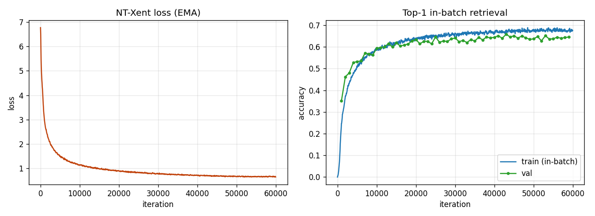
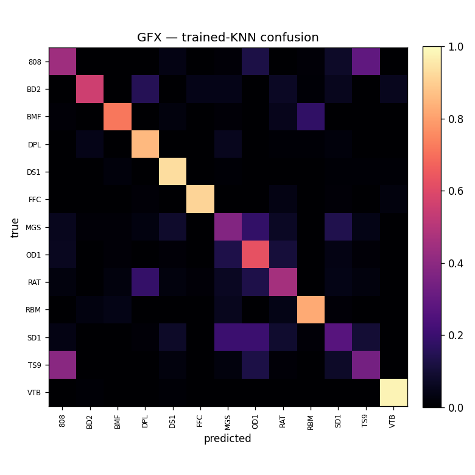
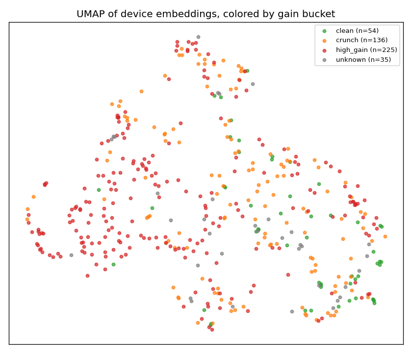

# Phase 3 Report — Contrastive Guitar-Effects Encoder

Self-supervised (SimCLR / NT-Xent) 1-D conv encoder trained on the Phase 2 rendered dataset, evaluated as a **frozen** feature extractor with KNN and MLP probes on external effect datasets (spec §4).

## 1. Model & training

- Encoder: 109,392 params (1-D residual conv, 64-d embedding).
- Training: 60000 iterations, batch 128, Adam lr 0.001, temperature 0.1, 450 devices.
- Best val in-batch retrieval (top-1): **65.8%** (chance ≈ 0.4%).
- Sanity milestone (step 2000): train retrieval 37.4% — clearly above chance.
- Wall time: 0.88 h on one GPU.

## 2. Frozen-probe accuracy vs. controls

**Domain scope.** The encoder is trained only on **amp/distortion** NAM captures (our 450 devices are ~50% high-gain, ~30% crunch, ~12% clean — no modulation, delay, or reverb). So it represents *distortion / tonal character*, not time-based or modulation effects. Read the datasets accordingly:

- **GFX** — all 13 classes are distortion/overdrive/fuzz → **in scope** (and the paper's own primary/Table I set). This is the headline result.

- **EGFxSet-drive** — the drive/distortion subset (Clean, BluesDriver, RAT, TubeScreamer) → **in scope**, a fair external check.

- **EGFxSet (full 13)** — mostly modulation/delay/reverb → **out of scope**; shown for completeness. A spectral (MFCC) baseline is expected to be competitive here because those effects have strong spectral signatures the encoder was never trained to key on.

Probes on the **pre-projection** embedding. Controls: identical probes on a randomly-initialized encoder (paper's control) and on MFCC mean/std features. Higher is better; chance = largest class share.

| Dataset | Classes | N | Chance | Trained KNN | Trained MLP | Random KNN | Random MLP | MFCC KNN | MFCC MLP |
|---|--:|--:|--:|--:|--:|--:|--:|--:|--:|
| GFX | 13 | 5200 | 8.9% | **66.0%** | **64.8%** | 20.7% | 25.9% | 53.6% | 56.0% |
| EGFxSet-drive | 4 | 2760 | 25.0% | **100.0%** | **100.0%** | 47.7% | 69.6% | 96.1% | 93.2% |
| EGFxSet | 13 | 8970 | 7.7% | **66.3%** | **65.5%** | 16.9% | 24.4% | 69.1% | 66.7% |
| internal-amp-by-make | 12 | 540 | 10.2% | **100.0%** | **100.0%** | 26.9% | 30.6% | 88.0% | 69.4% |

- *GFX*: external; distortion effects on IDMT clean recordings
- *EGFxSet-drive*: external, real hardware; IN-SCOPE drive/distortion subset (Clean, BluesDriver, RAT, TubeScreamer)
- *EGFxSet*: external, real hardware; mostly OUT-OF-SCOPE effect families (mod/delay/reverb) for an amp-trained encoder
- *internal-amp-by-make*: IN-DOMAIN (encoder trained on these devices)

## 3. Comparison to the paper (Open-Amp Tables I & II)

Reference: Open-Amp (arXiv:2411.14972), frozen contrastive embeddings. Exact numbers differ because our encoder trains on our TONE3000/EGDB NAM renders (~450 devices) rather than the paper's larger Open-Amp/Proteus corpus, and our encoder is smaller; the target is matching **direction and rough magnitude**, and beating the random-init control by a wide margin (spec §5).

| Dataset | Ours KNN | Ours MLP | Paper KNN | Paper MLP | Ours − random (KNN) |
|---|--:|--:|--:|--:|--:|
| GFX | 66.0% | 64.8% | 84.5% | 87.9% | +45.3% |
| EGFxSet-drive | 100.0% | 100.0% | — | — | +52.3% |
| EGFxSet | 66.3% | 65.5% | — | 72.0% | +49.4% |
| internal-amp-by-make | 100.0% | 100.0% | — | — | +73.1% |

- *GFX* paper cell: overall; supervised FxNet baseline 86.9%.
- *EGFxSet* paper cell: cross-dataset MLP.

## 4. Confusion matrix (primary external result)

## 5. Embedding space (qualitative)

Device embeddings (mean over render clips) projected to 2-D, colored by Phase 1 gain bucket — the space should organize by tone character.

## 6. Notes & deviations

- **Crop pool:** training reads a precomputed in-RAM int16 crop pool (src/train/cropcache.py) instead of random NFS FLAC seek-reads (~25× faster; GPU-bound). Crops keep the different-position/file property; int16 costs ~96 dB SNR (inaudible).
- **Encoder size:** ~113 K target; ours is 109,392 (channel plan tuned to land near it).
- **Splits:** leak-free grouped 80/20 where the dataset defines a clean source (EGFxSet: by played note); stratified fallback otherwise.
- **In-domain set** is a sanity/UMAP check only (encoder trained on those devices); it is not an external generalization number.
